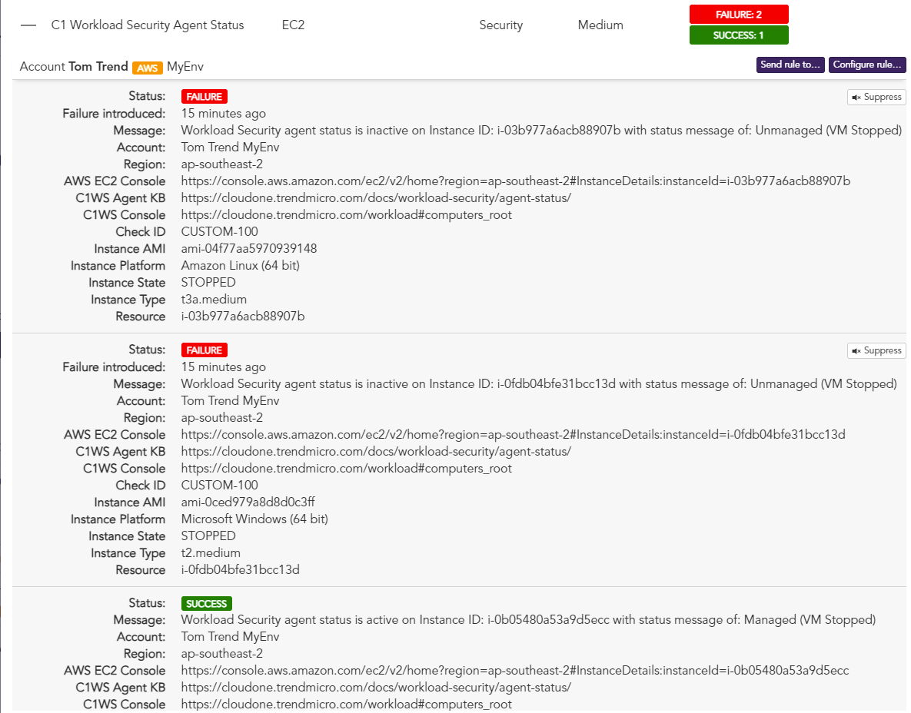

# Cloud One Conformity Custom Check - Workload Security Agent Status.
## Description
Once an hour get a get the computer status for all machines visibile within the AWS Cloud Connector within the Workload Security environment and check their agent status. Failures are raised for all instances which do not have the agent status of "active".

## Prerequisites
1. **Install AWS SAM CLI**
    - Visit [Installing the AWS SAM CLI](https://docs.aws.amazon.com/serverless-application-model/latest/developerguide/serverless-sam-cli-install.html) for detailed instructions for your Operating System.
    - Configure your [AWS Credentials](https://docs.aws.amazon.com/serverless-application-model/latest/developerguide/serverless-getting-started-set-up-credentials.html) for use with AWS SAM CLI.
2. **Configure Conformity API Key**
    - Log into **Conformity** and select your username and select `User settings`.
    - Select `API Keys`.
    - Select `+ New API Key`, then select `Generate Key`.
    - Copy the generated API Key for use later when installing the function.
3. **Configure Workload Security API Key**
    - Log into **Workload Security** and select `Administration`.
    - Expand `User Management` and select `API Keys`.
    - Select `New`, give your key a name and then select **Role** and select `Auditor` access. 
    - Select `Next` and copy the generated API key for use later when installing the function.

## Installation

### From AWS SAM CLI

1. Clone this repository from [Github](https://github.com/TomRyan-321/Cloud-One-Conformity-Custom-Checks).
2. Using your terminal navigate to the `C1WS-Agent-Status-Check` folder contained within the above cloned repository. Example: `User@Host:cd ~/Cloud-One-Conformity-Custom-Checks/C1WS-Agent-Status-Check`
3. Deploy the SAM template in guided mode. Example: `sam deploy --guided`
4. Fill in the required parameters as prompted. Defaults are provided for all values with the exception of WS & Conformity API keys which were obtained in prerequiste steps.
5. Select `Yes` by press `Y` to the following prompts: `Confirm changes before deploying`, `Allow SAM CLI IAM role creation`
6. Optionally save the above parameters to a configuration file when promtped (note API keys will **NOT** be written to this file and always need to be re-entered if redeploying)
7. Review the resources to be created/updated and select `Yes` by pressing `Y` to deploy the solution.

## Test the Application

The solution will automatically run one hour after successful deployment. Results will automatically appear with Conformity post a successful invocation. Alternatively follow the steps below to force a manual execution of the function.

**Manually trigger function**
- Navigate to the **Lambda > Functions** service console.
- Find and select the function deployed by the SAM template. Example: `sam-app-WSAgentStatusConformityChecksFunction-<UniqueIdentifier>`
- Select `Test` tab then select `Invoke`. (Leave test event template as the default hello-world values as these are not parsed by the function)
- Expand `Execution results` on completion and confirm result was `succeeded`. (If failed view the logs in **CloudWatch Logs** to determine any errors)
- Within **Conformity** select **Browse All Checks** and search for the findings which have been uploaded to your Account. (Quickly filter results by using the filter **Filter by resource Id, rule title or message** with a value of `C1 Workload Security Agent Status`).
- Review the results.